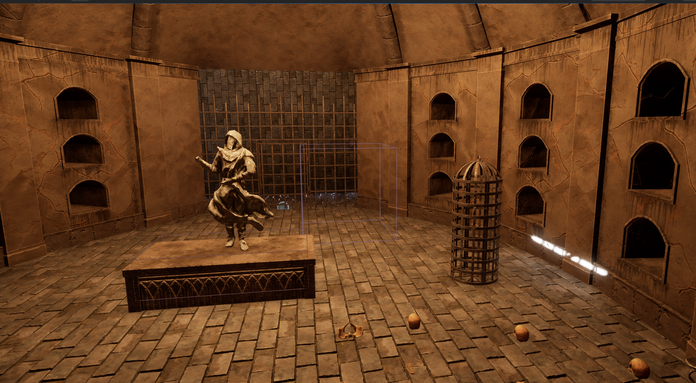
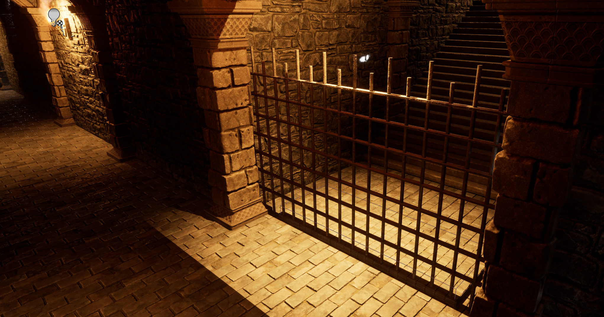
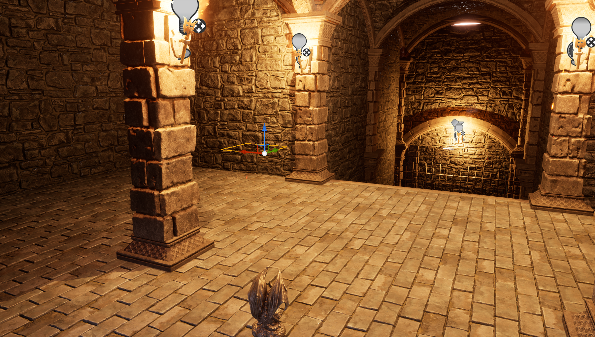

# Dungeon 项目

本项目为基于 Unreal Engine 的 Dungeon 游戏示例。

## 项目结构

- `Source/`：C++ 源码
- `Content/`：游戏资源，包括蓝图、材质、贴图等
- `Config/`：项目配置文件
- `Images/`：项目相关图片

## 项目截图

以下为项目相关图片：

| 图片 | 预览 |
| ---- | ---- |~~~~
| image1.png |  |
| image2.png |  |
| image3.png |  |

> 更多内容请参考 Unreal Engine 官方文档。

